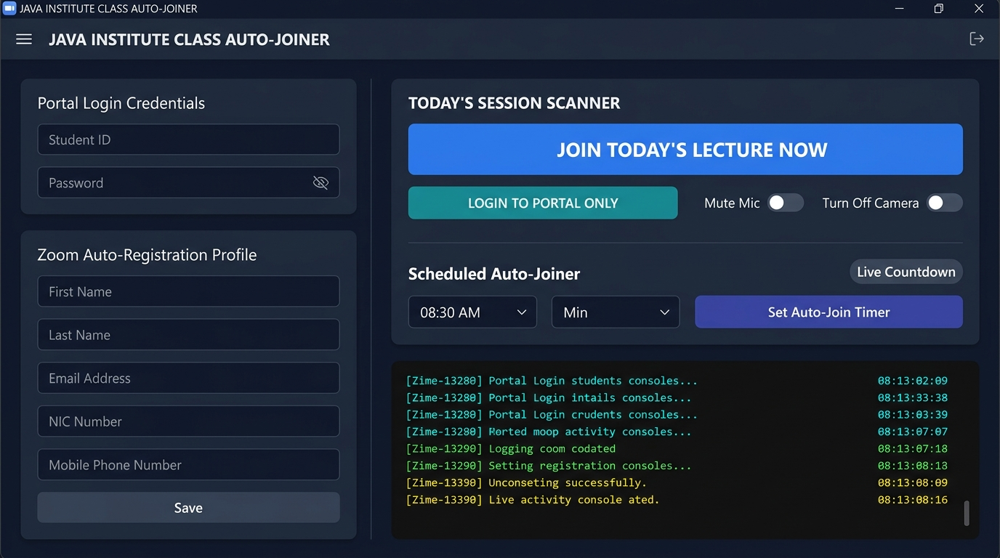

# Java Institute Portal - Class Auto-Joiner Pro (Single-User Edition) 🎓

  
  
  
  
  


A high-performance, automated desktop suite engineered for students of the **Java Institute for Advanced Technology**. Built with a streamlined single-user workflow, it allows a student to authenticate into the student portal with a single click, automatically acknowledge declaration modals, locate today’s scheduled live lecture from the active timetable, auto-complete Zoom meeting registration forms, and launch directly into class sessions inside Google Chrome with automated microphone and camera privacy protections.

 *

## 📸 User Interface Preview



 *

## 👨‍💻 Developed By

**Manja**

 *

## 🌟 Key Features

### 🚀 1. One-Click Instant Lecture Join

*   **Zero Manual Effort**: Launches Google Chrome, logs into the student portal, scans today’s timetable, auto-completes Zoom registration, and joins the live lecture directly inside your browser.
*   **Non-Blocking Multi-Threading**: Runs the browser automation engine on a dedicated background thread while keeping the desktop interface smooth and interactive.

### ⏰ 2. Smart Scheduled Auto-Joiner & Auto-Login (Timer Mode)

*   **Set Your Target Time**: Select any lecture start time (default: `11:40 PM` or your custom schedule) from the interactive dropdowns.
*   **Flexible Action Modes**: Choose between **`🚀 Auto Join Lecture`** (full class detection & join) or **`🔑 Portal Login Only`** (automatic dashboard login).
*   **Live Countdown Indicator**: Displays real-time remaining countdown (e.g., `⏳ In 01h 45m 20s`).
*   **Zero-Click Execution**: When the target time arrives, the application automatically wakes up, opens the browser, authenticates, and executes your selected action.

### 🔑 3. Seamless Portal Authentication & Modal Bypass

*   Automatically populates student credentials from `src/user_data.txt` and submits the login form.
*   Detects and auto-acknowledges declaration modals (*“I Agree”*) and trial notice popups (*“Continue”*), navigating directly to the student dashboard without getting stuck.

### 📅 4. Smart Timetable Scanner

*   Scans the **Active TimeTable** section on the student dashboard.
*   Automatically matches today’s date, day name, and time slot with scheduled lecture cards.
*   Extracts lecture module titles, batch information, lecturer names, and direct Zoom join links.

### 📝 5. Intelligent Zoom Auto-Registration

*   Automatically detects Zoom webinar and meeting registration forms.
*   Uses an intelligent context-aware DOM inspector that accurately identifies and fills:
    *   **First Name** & **Last Name**
    *   **Email Address** & **Confirmation Email**
    *   **NIC Number / National ID**
    *   **Contact / Mobile Phone Number**
*   Dispatches native React/DOM input events for instant validation and auto-submits the form.

### 🎥 6. Privacy-First In-Browser Joining

*   Joins meetings directly inside Google Chrome using the **Zoom Web Client** (no external Zoom desktop application required).
*   **Mic & Camera Privacy Controls**: Dedicated toggles (`🎤 Mute Mic` & `📷 Turn Off Camera`, ON by default) apply Chrome media permissions and mute audio/video before entering the live lecture room.
*   Auto-populates your display name and handles web client preview screen confirmation.

### 🖥️ 7. Ultra-Modern Dark GUI (CustomTkinter)

*   Sleek dark interface styled with modern deep obsidian palettes (`#090D16`), slate cards, and glassmorphism accents.
*   **Live Digital Clock**: Real-time header clock displaying live time and date (`🕒 HH:MM:SS AM/PM • 📅 Date`).
*   **Dynamic Status Badge**: Displays live states (`● SYSTEM READY`, `● TIMER: 11:40 PM`, `● AUTOMATING...`, `● JOINED SUCCESSFULLY`, `● ERROR`).
*   Interactive switches for camera/mic privacy, password visibility toggle (`👁 / 🔒`), and time pickers.

### 💻 8. Live Activity Console

*   High-tech color-coded terminal log window styled with Consolas monospace typography.
*   Real-time formatted log streams with timestamps and visual markers (`● Info`, `✔ Success`, `▲ Warning`, `✖ Error`).
*   Integrated one-click console clearing (`🧹 Clear`) and log clipboard copy (`📋 Copy`).

### 🔒 9. Clean Local Data Synchronization

*   All credentials and user profile information are loaded from and saved to `src/user_data.txt`.
*   Full two-way synchronization: update details directly inside the GUI or edit `src/user_data.txt` in any text editor.

 *

## 🚀 Quick Start Guide

### Prerequisites

1. Windows 10 / 11
2. Python 3.10+ (or let run.bat automatically install it for you!)
3. Google Chrome installed

### 1\. Launching the Application

#### Option A (Recommended - Windows Batch Launcher):

Double-click the **`run.bat`** file in the root directory.

> \[!TIP\]  
> `run.bat` automatically detects Python, installs Python if missing, sets up an isolated `.venv` environment, installs dependencies, and launches the application with a single click!

#### Option B (Command Line):

```bash
# Install dependencies
pip install -r src/requirements.txt

# Run application
python src/app.py
```

 *

## 📖 How to Use

### 1\. Initial Setup

*   Open the application (`run.bat` or `python src/app.py`).
*   Fill in your **Portal Credentials** (Username & Password).
*   Fill in your **Zoom Registration Profile** (First Name, Last Name, Email, NIC Number, Mobile Phone).
*   Click **`💾 Save Details`**.

### 2\. Joining Immediately

*   Click the large radiant blue **`🚀 JOIN TODAY'S LECTURE NOW`** button.
*   The system will automatically handle login, modal closing, timetable scanning, Zoom form filling, and browser joining.

### 3\. Scheduling for Later (Timer Mode)

*   Under **Scheduled Auto-Join Timer**:
    *   Select your preferred mode: **`🚀 Auto Join Lecture`** or **`🔑 Portal Login Only`**.
    *   Set the target time (e.g., `11:40 PM`).
    *   Click **`⏱ Set Auto Timer`**.
*   The live countdown will start. Once the clock reaches the set time, it will automatically wake up and execute the selected action!

### 4\. Portal Dashboard Only

*   Click the teal **`🔑 LOGIN TO STUDENT PORTAL ONLY`** button to log into the Java Institute student portal dashboard without scanning or joining Zoom.

 *

## 📁 Project Architecture

```
Class Auto-Joiner Pro (single-user)/
│
├── ⚡ run.bat                # One-Click Root Launcher (Auto-Installs Python, Venv, & Dependencies)
│
├── 📁 src/                   # Source Application Directory
│   ├── app.py                # Main GUI Application (CustomTkinter, Live Clock, Console)
│   ├── portal_automation.py  # Selenium Automation Engine (Login, Modal Bypass, Zoom Join)
│   ├── requirements.txt      # Python Package Dependencies
│   └── user_data.txt         # Local Configuration & Credentials File
│
├── 🛡️ .gitignore              # Ignores .venv, cache, and temporary files
├── 📜 LICENSE                # MIT Open-Source License
├── 📖 README.md              # Project Documentation
└── 🖼️ assets/
    └── ui_preview.png        # UI Preview Screenshot
```

 *

## ⚙️ Configuration File (`src/user_data.txt`)

All user data is stored locally in `src/user_data.txt`. You can edit it directly in any text editor:

```properties
# =========================================================
# JAVA INSTITUTE CLASS AUTO-JOINER - USER CONFIGURATION
# You can view and edit your credentials and profile here.
# =========================================================

USERNAME=200599999999
PASSWORD=YourPasswordHere#
FIRST_NAME=Sura
LAST_NAME=Pappa
EMAIL=surapappa@gmail.com
NATIONAL_ID=200599999999
PHONE_NUMBER=0701234567
SCHEDULED_TIME=11:40 PM
```

> \[!NOTE\]  
> All credentials and personal profile information remain strictly on your local machine in `src/user_data.txt`. No external servers or analytics are used.

 *

## 🛡️ Privacy, Security & Anti-Detection

*   **Zero Plaintext Code Hardcoding**: Credentials and personal details are strictly isolated in `src/user_data.txt` and never hardcoded into source files.
*   **Microphone & Camera Privacy**: Audio input and video capture permissions are blocked at the browser level (`prefs` in Chrome options) and muted in the Zoom interface before entering the lecture room.
*   **Anti-Bot & Stealth Configuration**: Chrome is initialized with `--disable-blink-features=AutomationControlled`, `--disable-infobars`, and custom window settings to minimize automated detection triggers.
*   **Session Persistence**: Chrome runs in detached mode (`options.add_experimental_option("detach", True)`), ensuring your live lecture session remains uninterrupted even after the automation script completes.

 *

## ⚠️ Disclaimer

This automation software is developed for educational and personal workflow efficiency. Please use responsibly and adhere to the guidelines and policies of your academic institution.