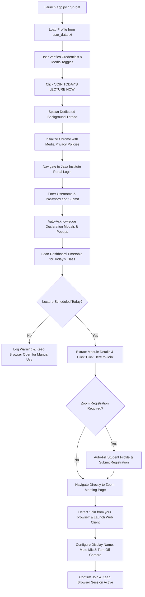

# Java Institute Portal - Class Auto-Joiner Pro (Single-User Edition) 🎓


A high-performance, automated desktop suite engineered for students of the **Java Institute for Advanced Technology**. Built with a streamlined single-user workflow, it allows a student to authenticate into the student portal with a single click, automatically acknowledge declaration modals, locate today's scheduled live lecture from the active timetable, auto-complete Zoom meeting registration forms, and launch directly into class sessions inside Google Chrome with automated microphone and camera privacy protections.

> [!IMPORTANT]
> **Single-User Dedicated Architecture:**  
> This software is purpose-built and optimized exclusively for single-user operation. It automates the routine of an individual student with zero multi-user overhead, keeping credentials, portal session states, and Zoom registration details synchronized directly with your local configuration file (`user_data.txt`).

---

## 👨‍💻 Developed By
**Manja**

---

## 🌟 Key Features

### 🚀 1. One-Click Automated Routine
* **Instant Automation**: Launches Google Chrome, logs into the student portal, parses today's timetable, and navigates seamlessly to the live lecture.
* **Non-Blocking Multi-Threading**: Runs the browser automation engine on a dedicated background thread while keeping the desktop interface responsive and interactive.

### 🔑 2. Seamless Portal Authentication & Modal Bypass
* Automatically populates student credentials and submits the login form.
* Detects and auto-acknowledges declaration modals (*"I Agree"*) and trial notice popups (*"Continue"*), ensuring direct redirection to the student dashboard without manual intervention.

### 📅 3. Smart Timetable Scanner
* Scans the **Active TimeTable** section on the student dashboard.
* Automatically matches today's date, day name, and time slot with scheduled lecture cards.
* Extracts lecture module titles, batch information, lecturer names, and direct Zoom join links.

### 📝 4. Automated Zoom Registration
* Automatically detects Zoom webinar and meeting registration forms.
* Dynamically fills in required student fields:
  * First Name & Last Name
  * Student Email Address & Confirmation Email
  * National ID / NIC Number
  * Contact Mobile Phone Number
* Submits the registration form and transitions to the confirmation page.

### 🎥 5. Privacy-First In-Browser Joining
* Joins meetings directly inside Google Chrome using the **Zoom Web Client** (no external Zoom desktop application required).
* **Mic & Camera Privacy Controls**: Dedicated toggles (`🎤 Mute Mic` & `📷 Turn Off Camera`, ON by default) apply Chrome media permissions and mute audio/video before entering the live lecture room.
* Auto-populates your display name and handles web client preview screen confirmation.

### 🖥️ 6. Modern Dark-Mode GUI (CustomTkinter)
* Sleek dark interface styled with modern slate palettes and glassmorphism accents.
* Dynamic status pill badge displaying live states (`● SYSTEM READY`, `● AUTOMATING...`, `● JOINED SUCCESSFULLY`, `● SESSION ACTIVE`, `● ERROR`).
* Interactive switches for camera/mic privacy and password visibility toggle (`👁 / 🔒`).

### 💻 7. Live Activity Console
* High-tech color-coded terminal log window styled with Consolas monospace typography.
* Real-time formatted log streams with timestamps and visual markers (`● Info`, `✔ Success`, `▲ Warning`, `✖ Error`).
* Integrated one-click console clearing and quick shortcut buttons to open `user_data.txt` or the project folder.

### 🔒 8. Clean Local Data Synchronization
* All credentials and user profile information are loaded from and saved to `user_data.txt`.
* Full two-way synchronization: update details directly inside the GUI or edit `user_data.txt` in any text editor.

---

## 🔄 Automation Workflow



---

## 🚀 Quick Start Guide

### Prerequisites
1. **Windows 10 / 11**
2. **Python 3.10+** installed and added to your system `PATH`
3. **Google Chrome** installed

### 1. Installation
Clone or download this repository, open a terminal in the project folder, and install the required dependencies:

```bash
pip install -r requirements.txt
```

### 2. Launching the Application

#### Option A (Recommended - Windows Batch Launcher):
Double-click the **`run.bat`** file in the root directory.

#### Option B (Command Line):
```bash
python app.py
```

---

## ⚙️ Configuration & Profile Management

### Setting Up Your Credentials & Profile
You can configure your portal credentials and Zoom registration details in two ways:

#### Method 1: Through the Application GUI (Recommended)
1. Launch the application via `run.bat` or `python app.py`.
2. Enter your details in the **Portal Login Credentials** and **Zoom Auto-Registration Profile** sections:
   * **Student ID / Username**
   * **Portal Password**
   * **First Name & Last Name**
   * **Email Address**
   * **National ID Number (NIC)**
   * **Mobile Phone Number**
3. Click **`💾 Save Details to user_data.txt`**.

#### Method 2: Direct File Configuration (`user_data.txt`)
All user data is stored locally in `user_data.txt`. You can edit it with any text editor (e.g. Notepad):

```properties
# =========================================================
# JAVA INSTITUTE CLASS AUTO-JOINER - USER CONFIGURATION
# You can view and edit your credentials and profile here.
# =========================================================

USERNAME=YOUR_STUDENT_ID
PASSWORD=YOUR_PORTAL_PASSWORD
FIRST_NAME=John
LAST_NAME=Doe
EMAIL=student@example.com
NATIONAL_ID=STUDENT_NIC_OR_ID
PHONE_NUMBER=07XXXXXXXX
```

> [!NOTE]
> All credentials and personal profile information remain strictly on your local machine in `user_data.txt`. No external servers or analytics are used.

---

## 📁 Project Architecture

| File / Folder | Role & Description |
| :--- | :--- |
| **`app.py`** | Modern graphical user interface (CustomTkinter) featuring profile fields, one-click launcher, media toggles, live color-coded console, and status indicators. |
| **`portal_automation.py`** | Core automation engine powered by Selenium WebDriver. Manages Chrome launch, portal authentication, modal handling, timetable scanning, Zoom registration, and in-browser joining. |
| **`user_data.txt`** | Dedicated local configuration file storing portal credentials and student profile details. |
| **`run.bat`** | Windows one-click executable batch launcher. |
| **`requirements.txt`** | Python dependencies (`selenium`, `webdriver-manager`, `customtkinter`). |

---

## 🛡️ Privacy, Security & Anti-Detection

* **Zero Plaintext Code Hardcoding**: Credentials and personal details are strictly isolated in `user_data.txt` and never hardcoded into source files.
* **Microphone & Camera Privacy**: Audio input and video capture permissions are blocked at the browser level (`prefs` in Chrome options) and muted in the Zoom interface before entering the lecture room.
* **Anti-Bot & Stealth Configuration**: Chrome is initialized with `--disable-blink-features=AutomationControlled`, `--disable-infobars`, and custom window settings to minimize automated detection triggers.
* **Session Persistence**: Chrome runs in detached mode (`options.add_experimental_option("detach", True)`), ensuring your live lecture session remains uninterrupted even after the automation script completes.

---

## ⚠️ Disclaimer
This automation software is developed for educational and personal workflow efficiency. Please use responsibly and adhere to the guidelines and policies of your academic institution.
