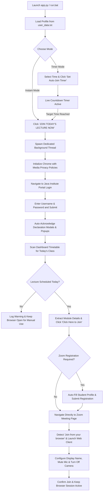

# Java Institute Portal - Class Auto-Joiner Pro (Single-User Edition) 🎓


A high-performance, automated desktop suite engineered for students of the **Java Institute for Advanced Technology**. Built with a streamlined single-user workflow, it allows a student to authenticate into the student portal with a single click, automatically acknowledge declaration modals, locate today's scheduled live lecture from the active timetable, auto-complete Zoom meeting registration forms, and launch directly into class sessions inside Google Chrome with automated microphone and camera privacy protections.

---

## 📸 User Interface Preview


---

## 👨‍💻 Developed By
**Manja**

---

## 🌟 Key Features

### 🚀 1. One-Click Instant Lecture Join
* **Zero Manual Effort**: Launches Google Chrome, logs into the student portal, scans today's timetable, auto-completes Zoom registration, and joins the live lecture directly inside your browser.
* **Non-Blocking Multi-Threading**: Runs the browser automation engine on a dedicated background thread while keeping the desktop interface smooth and interactive.

### ⏰ 2. Scheduled Auto-Joiner (Timer Mode)
* **Set Your Class Time**: Select the lecture start time (e.g. `08:30 AM`) from the interactive dropdowns and click **"⏱ Set Auto-Join Timer"**.
* **Live Countdown Indicator**: Displays real-time remaining time (e.g. `⏳ In 01h 45m 20s`).
* **Zero-Click Auto Execution**: When the target time arrives, the application automatically wakes up, opens the browser, logs in, fills the Zoom form, and joins your lecture room automatically.

### 🔑 3. Seamless Portal Authentication & Modal Bypass
* Automatically populates student credentials from `user_data.txt` and submits the login form.
* Detects and auto-acknowledges declaration modals (*"I Agree"*) and trial notice popups (*"Continue"*), navigating directly to the student dashboard without getting stuck.

### 📅 4. Smart Timetable Scanner
* Scans the **Active TimeTable** section on the student dashboard.
* Automatically matches today's date, day name, and time slot with scheduled lecture cards.
* Extracts lecture module titles, batch information, lecturer names, and direct Zoom join links.

### 📝 5. Intelligent Zoom Auto-Registration
* Automatically detects Zoom webinar and meeting registration forms.
* Uses an intelligent context-aware DOM inspector that accurately identifies and fills:
  * **First Name** & **Last Name**
  * **Email Address** & **Confirmation Email**
  * **NIC Number / National ID**
  * **Contact / Mobile Phone Number**
* Dispatches native React/DOM input events for instant validation and auto-submits the form.

### 🎥 6. Privacy-First In-Browser Joining
* Joins meetings directly inside Google Chrome using the **Zoom Web Client** (no external Zoom desktop application required).
* **Mic & Camera Privacy Controls**: Dedicated toggles (`🎤 Mute Mic` & `📷 Turn Off Camera`, ON by default) apply Chrome media permissions and mute audio/video before entering the live lecture room.
* Auto-populates your display name and handles web client preview screen confirmation.

### 🖥️ 7. Modern Dark-Mode GUI (CustomTkinter)
* Sleek dark interface styled with modern slate palettes and glassmorphism accents.
* Dynamic status pill badge displaying live states (`● SYSTEM READY`, `● TIMER: 08:30 AM`, `● AUTOMATING...`, `● JOINED SUCCESSFULLY`, `● ERROR`).
* Interactive switches for camera/mic privacy, password visibility toggle (`👁 / 🔒`), and time pickers.

### 💻 8. Live Activity Console
* High-tech color-coded terminal log window styled with Consolas monospace typography.
* Real-time formatted log streams with timestamps and visual markers (`● Info`, `✔ Success`, `▲ Warning`, `✖ Error`).
* Integrated one-click console clearing and quick shortcut buttons to open `user_data.txt` or the project folder.

### 🔒 9. Clean Local Data Synchronization
* All credentials and user profile information are loaded from and saved to `user_data.txt`.
* Full two-way synchronization: update details directly inside the GUI or edit `user_data.txt` in any text editor.

---

## 🔄 Automation Workflow



---

## 🚀 Quick Start Guide

### Prerequisites
1. **Windows 10 / 11**
2. **Python 3.10+** installed and added to your system `PATH`
3. **Google Chrome** installed

### 1. Installation
Clone or download this repository, open a terminal in the project folder, and install the required dependencies:

```bash
pip install -r requirements.txt
```

### 2. Launching the Application

#### Option A (Recommended - Windows Batch Launcher):
Double-click the **`run.bat`** file in the root directory.

#### Option B (Command Line):
```bash
python app.py
```

---

## 📖 How to Use (භාවිතා කරන ආකාරය)

### 1. Initial Setup (පළමු වරට සැකසීම):
* Open the application (`run.bat` or `python app.py`).
* Fill in your **Portal Credentials** (Username & Password).
* Fill in your **Zoom Registration Profile** (First Name, Last Name, Email, NIC Number, Mobile Phone).
* Click **`💾 Save Details to user_data.txt`**.

### 2. Joining Immediately (වහාම පන්තියට සම්බන්ධ වීම):
* Click the large blue **`🚀 JOIN TODAY'S LECTURE NOW`** button.
* The system will automatically handle login, modal closing, timetable scanning, Zoom form filling, and browser joining.

### 3. Scheduling Auto-Join for Later (වේලාවකට Timer එකක් සැකසීම):
* Under **Scheduled Auto-Joiner**, select the class starting hour, minute, and AM/PM (e.g. `08:30 AM`).
* Click **`⏱ Set Auto-Join Timer`**.
* The live countdown will start. You can leave the application open; once the clock hits the set time, it will automatically join the lecture for you!

### 4. Portal Dashboard Only (පෝටල් එකට පමණක් Login වීම):
* Click the teal **`🔑 LOGIN TO PORTAL ONLY`** button to log into the Java Institute student portal dashboard without scanning or joining Zoom.

---

## ⚙️ Configuration File (`user_data.txt`)

All user data is stored locally in `user_data.txt`. You can edit it directly in any text editor:

```properties
# =========================================================
# JAVA INSTITUTE CLASS AUTO-JOINER - USER CONFIGURATION
# You can view and edit your credentials and profile here.
# =========================================================

USERNAME=200516703056
PASSWORD=YourPasswordHere#
FIRST_NAME=Dilshan
LAST_NAME=Gamage
EMAIL=your_email@gmail.com
NATIONAL_ID=200516703056
PHONE_NUMBER=0703026293
SCHEDULED_TIME=08:30 AM
```

> [!NOTE]
> All credentials and personal profile information remain strictly on your local machine in `user_data.txt`. No external servers or analytics are used.

---

## 📁 Project Architecture

| File / Folder | Role & Description |
| :--- | :--- |
| **`app.py`** | Modern graphical user interface (CustomTkinter) featuring profile fields, one-click launcher, timer scheduler, media toggles, live color-coded console, and status indicators. |
| **`portal_automation.py`** | Core automation engine powered by Selenium WebDriver. Manages Chrome launch, portal authentication, modal handling, timetable scanning, smart Zoom registration, and in-browser joining. |
| **`user_data.txt`** | Dedicated local configuration file storing portal credentials, student profile details, and scheduled timer preferences. |
| **`assets/`** | Contains visual media and application preview images for documentation. |
| **`run.bat`** | Windows one-click executable batch launcher. |
| **`requirements.txt`** | Python dependencies (`selenium`, `webdriver-manager`, `customtkinter`). |

---

## 🛡️ Privacy, Security & Anti-Detection

* **Zero Plaintext Code Hardcoding**: Credentials and personal details are strictly isolated in `user_data.txt` and never hardcoded into source files.
* **Microphone & Camera Privacy**: Audio input and video capture permissions are blocked at the browser level (`prefs` in Chrome options) and muted in the Zoom interface before entering the lecture room.
* **Anti-Bot & Stealth Configuration**: Chrome is initialized with `--disable-blink-features=AutomationControlled`, `--disable-infobars`, and custom window settings to minimize automated detection triggers.
* **Session Persistence**: Chrome runs in detached mode (`options.add_experimental_option("detach", True)`), ensuring your live lecture session remains uninterrupted even after the automation script completes.

---

## ⚠️ Disclaimer
This automation software is developed for educational and personal workflow efficiency. Please use responsibly and adhere to the guidelines and policies of your academic institution.
